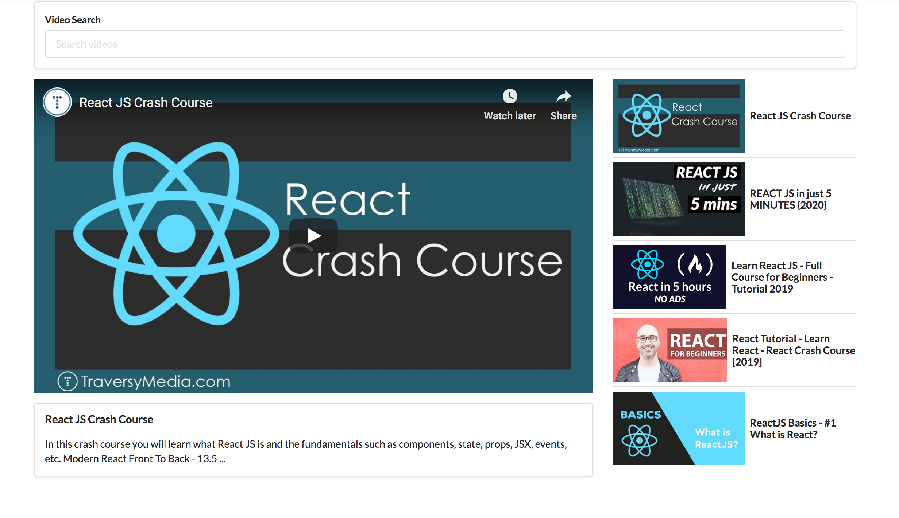

# React Video Search

Video interace that allows user to search for videos from youTube via youTube API. Returns video list and standard video player information.

Incorporate Tachyons, a functional css libary for styling.

## Purpose

Small project to build understanding about how to split up UI into components and how that effects how you manage the state of components.

Screen capture of interface:

